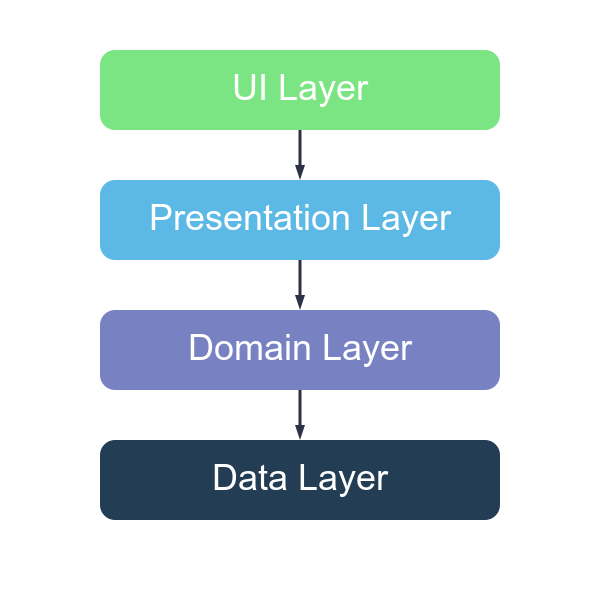

# Notely Voice

[](http://kotlinlang.org)
[](https://www.jetbrains.com/lp/compose-multiplatform)
[](https://android-arsenal.com/api?level=21)

A modern, cross-platform note-taking application with powerful offline speech recognition capabilities built with Compose Multiplatform

## iOS Screenshots

  

## Android Screenshots

  

## Features

### Note-Taking
✏️ **Rich Text Editing** - Format your notes with:
- Headers and sub-headers
- Title styling
- Bold, italic, and underline text
- Text alignment (left, right, center)

🔍 **Simple Search** - Find your notes instantly with text search  
📊 **Smart Filtering** - Filter notes by type (Starred, Voice Notes, Recent)  
📂 **Organization** - Categorize notes with folders and tags

### Speech Recognition
🎙️ **Advanced Speech-to-Text** - Convert speech to text with high accuracy  
🌐 **Offline Capability** - Speech recognition works without an internet connection  
🔄 **Seamless Integration** - Dictate directly into notes or transcribe audio recordings  
🎧 **Audio Recording** - Record voice notes and play them back within the app

### General
🌓 **Theming** - Switch between dark and light themes based on your preference  
💻 **Cross-Platform** - Seamless experience across Android & iOS  
📱 **Offline Functionality** - Full app functionality without an internet connection  
💾 **Export Options** - Share and export notes in multiple formats

## Speech Recognition Technology

- **Vosk-API** - Provides complete offline speech recognition capability
  - Works on resource-constrained devices like Raspberry Pi and Android smartphones
  - No internet connection required for speech-to-text functionality
  - Perfect for taking notes in areas with poor connectivity

- **iOS Integration** - Uses native iOS SFSpeechRecognizer
  - Leverages Apple's speech recognition framework for optimal iOS performance
  - Seamless integration with iOS audio systems
  - Advanced audio speech transcription using SFSpeechRecognizer

## Built With 🛠

- **[Kotlin](https://kotlinlang.org/)** - Official programming language for Android development
- **[Compose Multiplatform](https://www.jetbrains.com/lp/compose-multiplatform/)** - UI toolkit for building native applications
- **[Coroutines](https://kotlinlang.org/docs/coroutines-overview.html)** - For asynchronous programming
- **[Clean Architecture](https://developer.android.com/topic/architecture)** - Ensures scalability and testability
- **[ViewModel](https://developer.android.com/topic/libraries/architecture/viewmodel)** - Stores and manages UI-related data
- **[Dagger-Hilt](https://dagger.dev/hilt/)** - Dependency injection for Android
- **[Material 3](https://m3.material.io/)** - Design system for modern UI
- **[Vosk-API](https://alphacephei.com/vosk/)** - Offline speech recognition engine
- **[SFSpeechRecognizer](https://developer.apple.com/documentation/speech/sfspeechrecognizer)** - iOS native speech recognition
- **Native Compose Navigation** - No third-party navigation libraries
- **Custom Text Editor** - Built from scratch without external editing libraries

## Architecture

Notely is built with Clean Architecture principles, separating the app into distinct layers:

- **UI Layer**: Compose UI components
- **Presentation Layer**: Platform Independent ViewModels
- **Domain Layer**: Business logic and use cases
- **Data Layer**: Repositories and data sources



## Project Structure
`shared/`: Contains shared business logic and UI code.

`androidApp/`: Contains Android-specific code.

`iosApp/`: Contains iOS-specific code.

## Contributing
Contributions are welcome! Please follow these steps:

- Fork the repository.
- Create a new branch for your feature or bug fix.
- Submit a pull request with a clear description of your changes.

## Getting Started

### Prerequisites

- Android Studio Ladybug or newer
- XCode 16.1
- JDK 11 or higher
- Kotlin 2.0.21 or higher

### Installation

1. Clone the repository
   ```sh
   git clone https://github.com/tosinonikute/Notely.git
   ```

2. Open the project in Android Studio
3. Sync the project with Gradle files
4. Run the app on an emulator or physical device

### License

```
Copyright 2024 Notely, Inc. All Rights Reserved.

Licensed under the Apache License, Version 2.0 (the "License");
you may not use this file except in compliance with the License.
You may obtain a copy of the License at

   http://www.apache.org/licenses/LICENSE-2.0

Unless required by applicable law or agreed to in writing, software
distributed under the License is distributed on an "AS IS" BASIS,
WITHOUT WARRANTIES OR CONDITIONS OF ANY KIND, either express or implied.
See the License for the specific language governing permissions and
limitations under the License.
```
